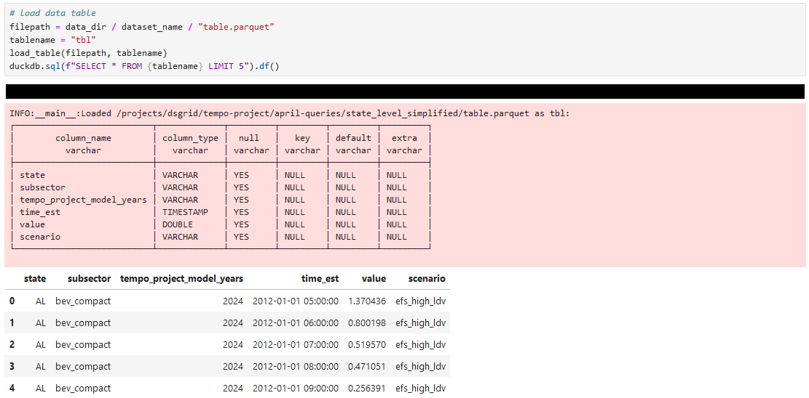

# TEMPO County-level Light-duty Electric Vehicle Charging Profiles v2022

This dsgrid project has been used to publish the hourly data documented in:

Yip, Arthur, Christopher Hoehne, Paige Jadun, Catherine Ledna, Elaine Hale, and Matteo Muratori. 2023. “Highly Resolved Projections of Passenger Electric Vehicle Charging Loads for the Contiguous United States.” Technical Report. Golden, CO (United States): National Renewable Energy Laboratory. https://www.nrel.gov/docs/fy23osti/83916.pdf.

via the [Open Energy Data Initiative (OEDI)](https://data.openei.org/home).

## Contents

- [dsgrid Project Definition and Files](#dsgrid-project-definition-and-files) - Describes the metadata, dimension, and mapping information available in [dsgrid-project-StandardScenarios/tempo_project](https://github.com/dsgrid/dsgrid-project-StandardScenarios/tree/main/tempo_project)
- [Output Data Files Available on OEDI](#output-data-files-available-on-oedi) - Describes what [files are available on OEDI](https://data.openei.org/submissions/5958) and documents best practices for using them.
- [Options for Accessing Different Slices of the Data](#options-for-accessing-different-slices-of-the-data) - Outlines options for creating or requesting the publication of different slices of the data than the ones that are already available.

## dsgrid Project Definition and Files

[dsgrid](https://github.com/dsgrid/dsgrid) provides a *dsgrid Project* container for aligning *Datasets* via *Base Dimensions*. dsgrid does this by requiring *dataset contributors* and *project coordinators* to very explicitly define resolution across eight [*Dimension Types*](https://dsgrid.github.io/dsgrid/explanations/components/dimensions.html#dimension-types):
- `scenario`
- `model_year`
- `weather_year`
- `geography`
- `time`
- `sector`
- `subsector`
- `metric`

In this project, whose purpose is to publish the TEMPO data documented in https://www.nrel.gov/docs/fy23osti/83916.pdf, the starting point is the [dataset](https://github.com/dsgrid/dsgrid-project-StandardScenarios/tree/main/tempo_project/dataset), whose *Dimensions* are defined in the `dimensions` portion of the `dataset.json5` config file, and in the `.csv` files referenced therein, which are available in the [dataset's dimensions folder](https://github.com/dsgrid/dsgrid-project-StandardScenarios/tree/main/tempo_project/dataset/dimensions). In brief, the dataset dimensions are:
- `scenario`: Projections are provided for three scenarios: 'Reference' ('reference'), 'EFS High LDVs' ('efs_high_ldv'), 'LDV Sales All-EV by 2035' ('ldv_sales_evs_2035'); `display name: 'scenario'`
- `model_year`: Projection years from 2018 to 2050 in two year intervals
- `weather_year`: Trivial dimension (only one element) indicating that these data follow the 2012 Actual Meteorological Year; `display name: 'weather_2012'`
- `geography`: Contiguous U.S. counties, American Community Survey (U.S. Census Bureau 2018)
- `time`: Representative week charging profiles, hourly for each month
- `sector`: Trivial dimension (only one element) equal to id: 'trans', name: 'Transportation'; `display name: 'transportation'`
- `subsector`: TEMPO household bins and vehicle types (60 household bins x 12 vehicle types=720 combinations); `display name: 'household_and_vehicle_type'`
- `metric`: Energy use split into L1&L2, DCFC; `display name: 'end_use'`

The project's *Base Dimensions*, which are outlined in the `base_dimensions` portion of the `project.json5` that lives in [the project folder](https://github.com/dsgrid/dsgrid-project-StandardScenarios/tree/main/tempo_project), mostly reuses the dataset's dimensions, with the following exceptions:
- `model_year`: Projection years from 2024 to 2050 in two year intervals; `display name: 'tempo_project_model_year'`
- `geography`: Contiguous U.S. counties (U.S. Census Bureau 2020); `display name: 'county'`
- `time`: Hourly, period beginning timestamps for 2012 (to match this project's weather year) as experienced in Eastern Standard Time (EST). Leap day is retained, and data are available for all 8784 EST hours.; `display name: 'time_est'`

Analogous to the dataset, the files referenced by the dimension definitions generally live in the [project's dimensions folder](https://github.com/dsgrid/dsgrid-project-StandardScenarios/tree/main/tempo_project/dimensions).

When dataset and project dimensions don't match for a given dimension type, the *dataset contributor* must provide a mapping file *unless the dimension type in question is a Time type*, in which case dsgrid handles the transformations programmatically. In this project, the dataset provides mapping files ([dimension_mappings.json5](https://github.com/dsgrid/dsgrid-project-StandardScenarios/blob/main/tempo_project/dataset/dimension_mappings.json5), [dimension_mappings folder](https://github.com/dsgrid/dsgrid-project-StandardScenarios/tree/main/tempo_project/dataset/dimension_mappings)) for:
- `model_year`: Drop data for historical years
- `geography`: Map vintage 2018 counties into vintage 2020 counties
- `metric`: Map the different labels used to indicate L1&L2 and DCFC together. (For example, the dataset uses the id `L1andL2` while the project uses the id `electricity_ev_l1l2`.)

And dsgrid translates TEMPO's representative week data into 8784 profiles that account for day of week, each geography's time zone, and daylight savings time.

dsgrid projects also enable [queries](https://dsgrid.github.io/dsgrid/tutorials/query_project.html), which start by mapping datasets to the project's base dimensions and then perform user-specified mapping, filtering, aggregation, and sorting operations. Outputs can of course use the project's base dimensions, but they can also make use of *Supplemental Dimensions*. The available supplemental dimensions are outlined in the `subset_dimensions` and `supplemental_dimensions` portions of the `project.json5` file, which refer to .csv files in the [dimensions/subset](https://github.com/dsgrid/dsgrid-project-StandardScenarios/tree/main/tempo_project/dimensions/subset) and [dimensions/supplemental](https://github.com/dsgrid/dsgrid-project-StandardScenarios/tree/main/tempo_project/dimensions/supplemental) folders. Regular *Supplemental Dimensions* and their [associated mapings](https://github.com/dsgrid/dsgrid-project-StandardScenarios/tree/main/tempo_project/dimension_mappings/base_to_supplemental) work analogously to dataset dimensions and their mappings. *Subset Dimensions* are simple alternative groupings of the project's base dimensions. Each subset dimension is defined in one file that maps each base dimension record of the given dimension type to a specific *Subset Dimension Selector* which functions as an element of the overall supplemental dimension and can also be used on its own to select or refer to specific slices of data.

The data published on OEDI makes use of the following supplemental dimensions:
- `metric`:
    - Subset dimension `end_uses_by_fuel_type`, which [maps](https://github.com/dsgrid/dsgrid-project-StandardScenarios/blob/main/tempo_project/dimensions/subset/enduses_by_fuel_type.csv) all energy use into `electricity_end_uses`
- `subsector`:
    - Subset dimension `subsector` which [maps](https://github.com/dsgrid/dsgrid-project-StandardScenarios/blob/main/tempo_project/dimensions/subset/dsgrid_subsectors.csv) TEMPO's 720 household bins and vehicle types into 8 simplified vehicle types (i.e., battery electric vehicle (BEV) or plug-in hybrid electric vehicle (PHEV), and compact, midsize, SUV, or pickup).
- `geography`:
    - Supplemental dimension `state`; [definition](https://github.com/dsgrid/dsgrid-project-StandardScenarios/blob/main/tempo_project/dimensions/supplemental/states.csv), [mapping](https://github.com/dsgrid/dsgrid-project-StandardScenarios/blob/main/tempo_project/dimension_mappings/base_to_supplemental/lookup_county_to_state.csv)
    - Supplemental dimension `census_division`; [definition](https://github.com/dsgrid/dsgrid-project-StandardScenarios/blob/main/tempo_project/dimensions/supplemental/census_divisions.csv), [mapping](https://github.com/dsgrid/dsgrid-project-StandardScenarios/blob/main/tempo_project/dimension_mappings/base_to_supplemental/lookup_county_to_censusdivision.csv)
    - Supplemental dimension `conus`, which aggregates all geographies together to represent the entire contiguous United States (CONUS); [definition](https://github.com/dsgrid/dsgrid-project-StandardScenarios/blob/main/tempo_project/dimensions/supplemental/conus.csv), [mapping](https://github.com/dsgrid/dsgrid-project-StandardScenarios/blob/main/tempo_project/dimension_mappings/base_to_supplemental/lookup_county_to_conus.csv)
- `model_year`:
    - Supplemental dimension `five_year_intervals`; [definition](https://github.com/dsgrid/dsgrid-project-StandardScenarios/blob/main/tempo_project/dimensions/supplemental/five_year_intervals.csv), [mapping](https://github.com/dsgrid/dsgrid-project-StandardScenarios/blob/main/tempo_project/dimension_mappings/base_to_supplemental/interpolate_to_five_year_intervals.csv)

Additional supplemental dimensions are defined in this dsgrid project, but have not been used in the published outputs:
- `subsector`:
    - Subset dimension `household_size`; [mapping](https://github.com/dsgrid/dsgrid-project-StandardScenarios/blob/main/tempo_project/dimensions/subset/household_size.csv)
    - Subset dimension `household_income`; [mapping](https://github.com/dsgrid/dsgrid-project-StandardScenarios/blob/main/tempo_project/dimensions/subset/household_income.csv)
    - Subset dimension `urbanity`; [mapping](https://github.com/dsgrid/dsgrid-project-StandardScenarios/blob/main/tempo_project/dimensions/subset/urbanity.csv)
    - Subset dimension `vehicle_technology`; [mapping](https://github.com/dsgrid/dsgrid-project-StandardScenarios/blob/main/tempo_project/dimensions/subset/vehicle_technology.csv)
    - Subset dimension `vehicle_class`; [mapping](https://github.com/dsgrid/dsgrid-project-StandardScenarios/blob/main/tempo_project/dimensions/subset/vehicle_class.csv)
- `geography`:
    - Supplemental dimension `census_region`; [definition](https://github.com/dsgrid/dsgrid-project-StandardScenarios/blob/main/tempo_project/dimensions/supplemental/census_regions.csv), [mapping](https://github.com/dsgrid/dsgrid-project-StandardScenarios/blob/main/tempo_project/dimension_mappings/base_to_supplemental/lookup_county_to_censusregion.csv)
    - Supplemental dimension `reeds_pca`; [definition](https://github.com/dsgrid/dsgrid-project-StandardScenarios/blob/main/tempo_project/dimensions/supplemental/reeds_pca.csv), [mapping](https://github.com/dsgrid/dsgrid-project-StandardScenarios/blob/main/tempo_project/dimension_mappings/base_to_supplemental/lookup_county_to_reeds_pca.csv)

## Output Data Files Available on OEDI

### Directory Structure and Contents

Output data are available through OEDI. The top-level folders availalbe in the Data Lake are:

| Folder Name              | Folder Contents                                          | Folder Size | Partitioned By                      |
| ------------------------ | -------------------------------------------------------- | ----------- | ----------------------------------- |
| query_files              | dsgrid query definitions in .json5 format                      |  32 K |                                     |
| full_dataset             | Full dataset in project base dimensions                        | 663 G | scenario, model_year, state, county |
| full_state_level_dataset | Aggregation to state                                           |       |                                     | 
| state_level_simplified   | Aggregation to state, subsector, and one (electric) end use    | 1.3 G | scenario                            |
| very_simple              | Aggregation to census division, one subsector, and one end use | 225 M | N/A                                 |
| annual_summary_conus     | Aggregation to conus, subsector, one end use, and annual time  |       | N/A                                 |
| annual_summary_state     | Aggregation to state, subsector, one end use, and annual time  | 404 K | N/A                                 |
| annual_summary_county    | Aggregation to county, subsector, one end use, and annual time |       | N/A                                 |

Each dataset folder contains:
- `query.json`: dsgrid query definition as output by the CLI in the course of running the query.
- `metadata.json`: File that describes the structure of the output table.
- `table.parquet`: Folder containing the output table in .parquet format. Some datasets are partitioned on meaningful columns, which makes it so that subfolders of `table.parquet` can be loaded as parquet files on their own to get access to certain slices of the data without loading the entire dataset.

### Working with Datasets

In this repository, under `tempo_project/notebooks`, we provide example notebooks you can run using [pyspark](HERE), [duckdb](HERE), or [pandas](HERE) after you adjust `data_dir` to point to the location where you have downloaded one or more of the folders listed above and `dataset_name` to be the name of the folder containing the dataset you want to access.

All three notebooks:
- Load the `metadata.json` files to programmatically access the dataset column names, and use that information to discern, e.g., geographic resolution, whether the data are hourly or annual.
- Display the initial timestamps (hourly data only).
    - The timestamps stored in the dsgrid .parquet files are in UTC and cover the EST year 2012. Depending on exactly how the data are loaded, the starting timestamp might show up as `2012-01-01 00:00:00` (i.e., the starting timestamp in EST) or as `2012-01-01 05:00:00` (i.e., the starting timestamp in UTC).
    - If the first timestamp is `2012-01-01 05:00:00` the notebook also demonstrates how to adjust the timestamps to start with `2012-01-01 00:00:00` as expected.
- Validate the data by:
    - Re-creating the lefthand side of Figure ES-1 in https://www.nrel.gov/docs/fy23osti/83916.pdf
    - For hourly data only, plotting daily load profiles for two different days, one during standard time and one during daylight savings time, and for four different geographies, one for each time zone in the contiguous United States

#### Loading the metadata

Although the dsgrid query interface provides other options, all of the published datasets have at most one column per dimension type and have been written in unpivoted format. Thus, the column names can be loaded as in this example:

```python
import json
from pathlib import Path

def get_metadata(dataset_path):
    with open(dataset_path / "metadata.json") as f:
        result = json.load(f)
    return result

# load metadata and get column names by type
metadata = get_metadata(data_dir / dataset_name) # data_dir is a pathlib.Path
assert metadata["table_format"]["format_type"] == "unpivoted", metadata["table_format"]
value_column = metadata["table_format"]["value_column"]
columns_by_type = {dim_type: metadata["dimensions"][dim_type][0]["column_names"][0] for dim_type in metadata["dimensions"]}
```

Note that although a column name is provided for each dimension type, trivial dimensions (i.e., those with only one possible value, like `weather_year`) are not included in the data files. Thus, not all column names listed in the metadata will actually be present in loaded data frames.


#### examples-spark.ipynb

Dependencies:
- python=3.10
- jupyter
- pyspark
- pandas
- plotly

Advantages: The data were originally created with Spark, and Spark can nominally work with all of the datasets.

Limitations: Although set-up is easy for local mode, performing queries on large datasets generally requires a multi-node cluster, which can be challenging to set up and expensive to run.

##### Getting Started

PySpark easily loads parquet files even when those files are actually directories containing a partitioned dataset. For example, running this code:
```
from pyspark.sql import SparkSession

spark = (
            SparkSession.builder
            .appName("dsgrid")
            .config("spark.sql.session.timeZone", "EST")
            .getOrCreate()
        )

dataset_name = "state_level_simplified"

# Load data table
filepath = data_dir / dataset_name / "table.parquet"
df = spark.read.parquet(str(filepath))
tablename = "tbl"
df.createOrReplaceTempView(tablename)
df.show(n=5)
```
in the notebook returns:


##### Writing Queries

[PySpark](https://spark.apache.org/docs/latest/api/python/index.html) data frames can be queried using functions like [filter](https://spark.apache.org/docs/latest/api/python/reference/pyspark.sql/api/pyspark.sql.DataFrame.filter.html#pyspark.sql.DataFrame.filter) or by writing straight SQL. In the notebook we use SQL. For example, this query (when the data are small enough to process):
```Python
df = spark.sql(f"""SELECT scenario, {columns_by_type["model_year"]} as year, SUM({value_column})/1.0E6 as annual_twh
                     FROM {tablename} 
                 GROUP BY scenario, {columns_by_type["model_year"]}
                 ORDER BY scenario, year""").toPandas()
```
returns a `pandas.DataFrame` containing three columns: `scenario`, `year`, and `annual_twh`.

And this is an example of how to select timestamps within a range:
```Python
import datetime as dt
    
# Select EST timestamps for 2/14/2012
start_timestamp = dt.datetime(2012, 2, 14, 0)
stop_timestamp = dt.datetime(2012, 2, 14, 23)

df = spark.sql(f"""SELECT time_est, SUM({value_column}) as {value_column}
                     FROM {tablename} 
                    WHERE {where_clause} AND (time_est >= TIMESTAMP '{start_timestamp}') AND (time_est <= TIMESTAMP '{end_timestamp}')
                GROUP BY time_est 
                ORDER BY time_est;""").toPandas()
```

##### Additional Reading


#### examples-duckdb.ipynb

Dependencies:
- python=3.10
- jupyter
- duckdb
- pandas
- plotly

Advantages: DuckDB makes the most efficient use of available resources and is trivial to set up.

Limitations: DuckDB is limited to one node and can run out of resources. What datasets you can analyze and what queries you can perform thus depends on the hardware you use.

##### Getting Started

DuckDB easily loads parquet files, but does not automatically load the information contained in partitioned folders. The `examples-duckdb.ipynb` provides a function, `load_table`, to perform this work so that, e.g., the `scenario` dimension gets loaded if you open the `state_level_simplified/table.parquet`, which contains folders:
- 'scenario=efs_high_ldv'
- 'scenario=ldv_sales_evs_2035'
- 'scenario=reference'

With `load_table` available, a dataset can be loaded and then previewed with the code:
```python
import duckdb

# load data table
filepath = data_dir / dataset_name / "table.parquet"
tablename = "tbl"
load_table(filepath, tablename)
duckdb.sql(f"SELECT * FROM {tablename} LIMIT 5").df()
```
For example, with `dataset_name = "state_level_simplified"` running this code in the notebook returns:


For completenss, here is the code for `load_table` and helper functions `is_partitioned`, `get_partitions`, and `table_exists`:
```python
def is_partitioned(filepath):
    for p in filepath.iterdir():
        if p.is_dir() and ("=" in p.stem) and (len(p.stem.split("=")) == 2):
            return True
    return False

def get_partitions(filepath):
    assert is_partitioned(filepath), f"{filepath} is not partitioned"
    
    partition_name = None
    for p in filepath.iterdir():
        if p.is_dir() and ("=" in p.stem):
            tmp, value = p.stem.split("=")
            if partition_name:
                assert (tmp == partition_name), f"Found two different partition names in {filepath}: {partition_name}, {tmp}"
            partition_name = tmp
            yield partition_name, value, p

def table_exists(tablename):
    tables = duckdb.sql("SHOW TABLES")
    if tables:
        return (tablename in tables.df()["name"].tolist())
    return False

def load_table(filepath, tablename, prefix=""):
    if not prefix:
        assert not table_exists(tablename), f"{tablename} already exists"

    if is_partitioned(filepath):
        for partition_name, partition_value, p in get_partitions(filepath):
            load_table(p, tablename, prefix=f"{prefix}'{partition_value}' AS {partition_name}, ")
        return
    
    # insert data
    if table_exists(tablename):
        duckdb.sql(f"INSERT INTO {tablename} SELECT {prefix}* FROM read_parquet('{filepath}/*.parquet');")
    else:
        duckdb.sql(f"CREATE TABLE {tablename} AS SELECT {prefix}* FROM read_parquet('{filepath}/*.parquet');")
    logger.info(f"Loaded {filepath}")
```

##### Writing Queries

[DuckDB](https://duckdb.org/docs/) provides a variety of interfaces. The example notebook uses the Python package to read .parquet files using the SQL interface. In this case, and assuming the data have been loaded as described above, one example query is:
```
df = duckdb.sql(f"""SELECT scenario, {columns_by_type["model_year"]} as year, SUM({value_column})/1.0E6 as annual_twh
                      FROM {tablename} 
                  GROUP BY scenario, {columns_by_type["model_year"]}
                  ORDER BY scenario, year""").df()
```
which returns a `pandas.DataFrame` containing three columns: `scenario`, `year`, and `annual_twh`.

A couple of timestamp-related queries that are demonstrated in the notebook include:
1. Shifting the timestamps to match the `time_est` label rather than being in `UTC` (example shown is for `dataset_name = "state_level_simplified"`):

      ```SQL
        SELECT scenario, state, tempo_project_model_years, subsector, time_est - INTERVAL 5 HOUR as time_est, weather_2012, value 
          FROM tbl 
         WHERE (scenario = 'reference') AND (tempo_project_model_years = 2050) AND (subsector = 'bev_compact')
      ORDER BY time_est 
         LIMIT 5;
    ```

2. Selecting timstamps within a range:

    ```Python
    import datetime as dt
    
    # Select UTC timestamps that correspond to EST 2/14/2012
    start_timestamp = dt.datetime(2012, 2, 14, 5)
    stop_timestamp = dt.datetime(2012, 2, 15, 4)

    duckdb.sql(f"""SELECT time_est, SUM({value_column}) as {value_column}
                     FROM {tablename} 
                    WHERE {where_clause} AND (time_est >= TIMESTAMP '{start_timestamp}') AND (time_est <= TIMESTAMP '{end_timestamp}')
                 GROUP BY time_est 
                 ORDER BY time_est;""")
    ```

##### Additional Reading

The following DuckDB documentaiton links might be helpful:
- [Parquet import and export](https://duckdb.org/docs/data/parquet/overview) - Our examples use `CREATE TABLE` and `INSERT INTO` to enable multiple queries on the same dataset without reloading the files.
- [Client APIs](https://duckdb.org/docs/api/overview) - Read up more on the Python API or try out a different API if you prefer to work in a different language.
- [SQL Syntax Documentation](https://duckdb.org/docs/sql/introduction) - This documentation starts from the basics and is well organized. Because timestamps are always hard for everyone, this page might be of particular interest: [Timestamp Functions](https://duckdb.org/docs/sql/functions/timestamp).


#### examples-pandas.ipynb

Dependencies:
- python=3.10
- jupyter
- pandas
- plotly

Advantages: Very familiar to many Python users and easy to use.

Limitations: Of the three documented options, pandas is least able to work with large datasets. For any of the large (e.g., 1 GB or greater on disk) datasets, most users will quickly run into issues trying to open the whole dataset as a pandas.DataFrame. For that reason, we have partitioned the large datasets into smaller chunks that should be openable (one-by-one) in this standard tool.

##### Getting Started


## Options for Accessing Different Slices of the Data

The datasets published on OEDI are meant to enable broad access for common use cases while balancing different users' ability to work with large datasets. However, we might not have covered your use case, and there are many other aggregations that are possible with the current set of supplemental dimensions and even more that could be created if additional supplemental dimensions were added to the dsgrid project.

There are essentially two reasons (alone or in combination) why working directly with the published data using your data analysis package of choice might not meet your needs:
1. Data size - The full dataset expands to over 1 TB in memory. Although some tools (like DuckDB) can nominally process very large datasets on a typical laptop by actively managing memory and CPU resources, in practice that can either take a very long time or fail if the query is very complex and/or not well aligned with how the data are laid out across files. Other tools present different challenges. For example, pandas can only work with datasets that fit in memory, and Spark can work with very large datasets but only if it can spread the work out over multiple compute nodes (in cluster, rather than local, mode).
2. Output dimensions - One or more dimension types might not be described at the level of resolution you want. Depending on the type of mapping desired, it may or may not be straightforward to perform your own join operations outside of dsgrid.

If you hit one of these issues, you have at least three options.

### Option 1: Write your own processing code to work through the data sequentially

Although you would not want to download the full dataset to most machines, you could process it sequentially using a combination of `awscli` and your data analysis package of choice. **Warning:** Not for the faint of heart, and you will want to double- and triple-check the result.

### Option 2: Reach out to the dsgrid team

If you're looking for a query that is easy to run and/or expected to be of broad interest, please email us at **FILL IN**. We will let you know if we are able to fulfill 
the request.

### Option 3: Use the dsgrid software yourself

*This is only possible if we publish the dataset data files as well ...? And users would have to go through the time mapping explosion? Unless we publish a serialized registry....*